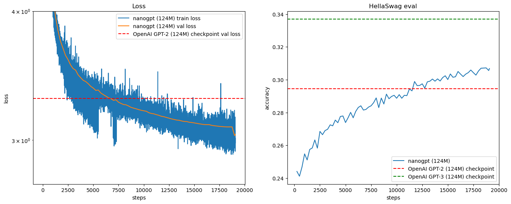

# nanogpt
The simplest, fastest repository for training/finetuning medium-sized GPTs inspired by Andrej.

## Get the dataset
1. Install `huggingface_hub`
2. Setting the mirror if in Mainland China: `export HF_ENDPOINT=https://hf-mirror.com`
3. `./fineweb-dataset.sh`
    - Modify the target folder path for further usage.
4. Install `datasets`, `tiktoken`

## Result
- Here is the final result graph of our 124M `nanoGPT` with the comparison to the OpenAI GPT-2.
    - The left one is the train-val loss compared with the GPT-2 baseline. 
    - The right one is the hellaSwag validation dataset compared to the OpenAI GPT-2.
    

## Task
- [X]  Process the final result to get the graph
- [ ] Formalize the README
- [X]  Train the model using RTX 4090
